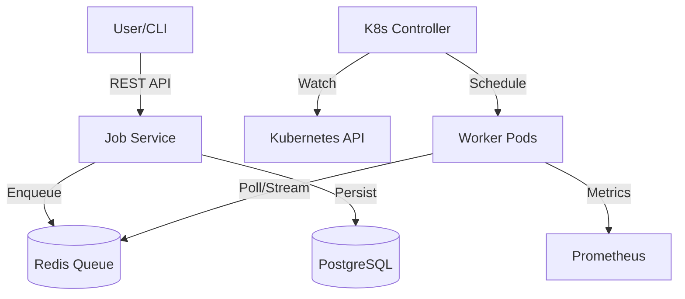
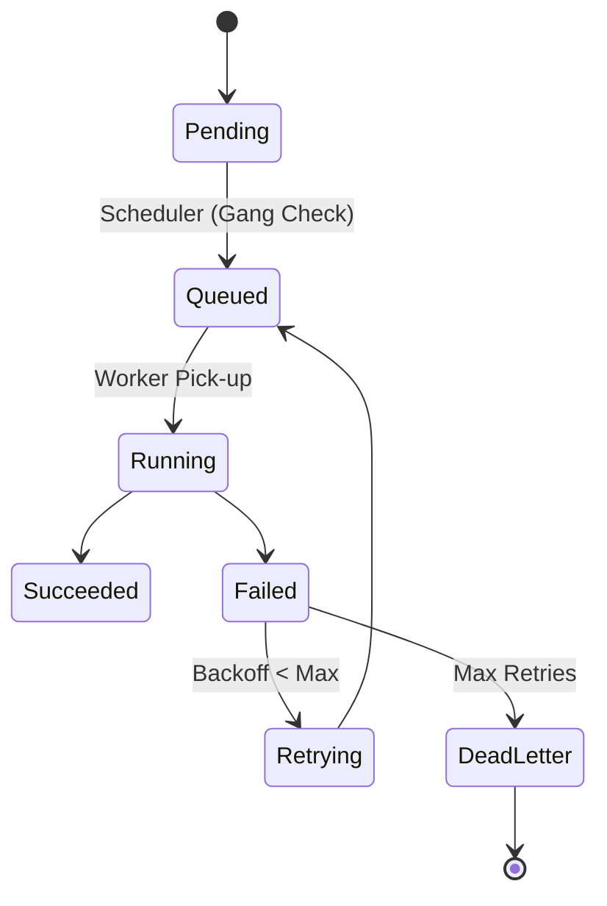

# System Architecture

## Overview
The AI Job Scheduler is designed as a Kubernetes-native application. It leverages Custom Resource Definitions (CRDs) to extend the Kubernetes API for domain-specific AI types.

## Components

### 1. Control Plane (Go)
- **Controller Manager**: Runs the core reconciliation loops.
- **AIJobReconciler**: Manages the lifecycle of jobs.
- **Scheduler**: Implements Gang Scheduling and Priority Preemption.
- **AgentRegistry**: Manages AI Agents for workflow automation.

### 2. Data Plane (Python & Redis)
- **API Service**: Stateless FastAPI application. Handles Auth (JWT), Rate Limiting, and Job Submission.
- **Redis**: Acts as a high-throughput queue and distributed lock manager.
- **PostgreSQL**: Stores persistent job history and metadata.

### 3. Compute Plane (Workers)
- **Inference Worker**: Loads models and processes requests.
- **Simulation Worker**: Generates synthetic sensor data (Camera, Lidar) and runs evaluation pipelines.

## Diagrams

### High-Level Architecture

### Job Lifecycle

