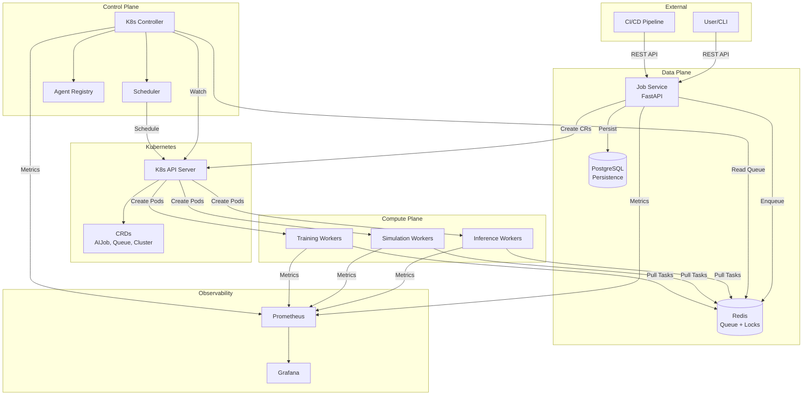
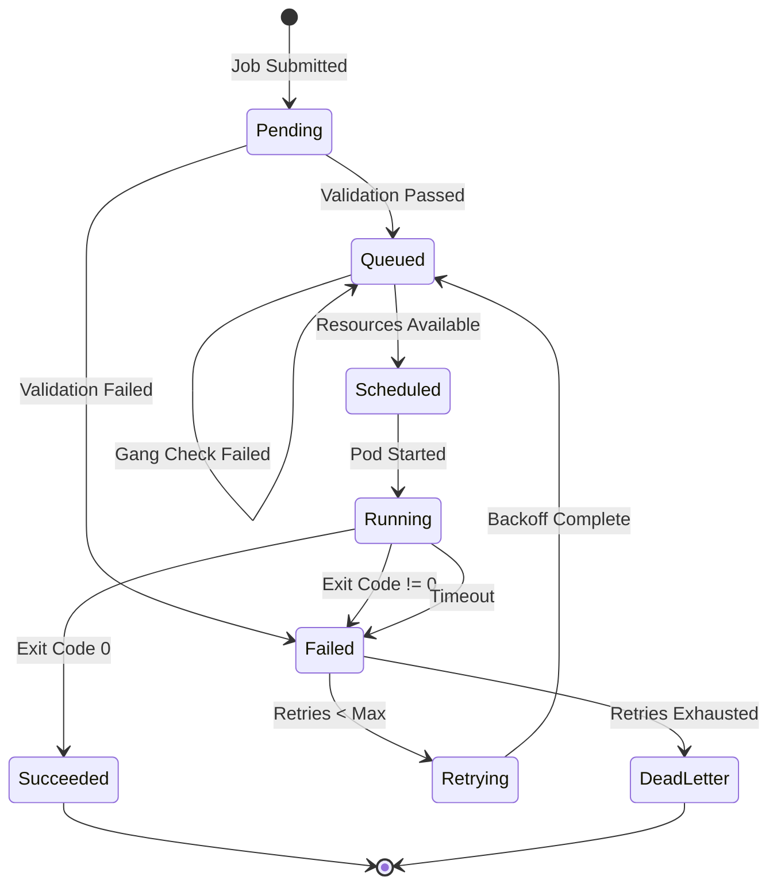
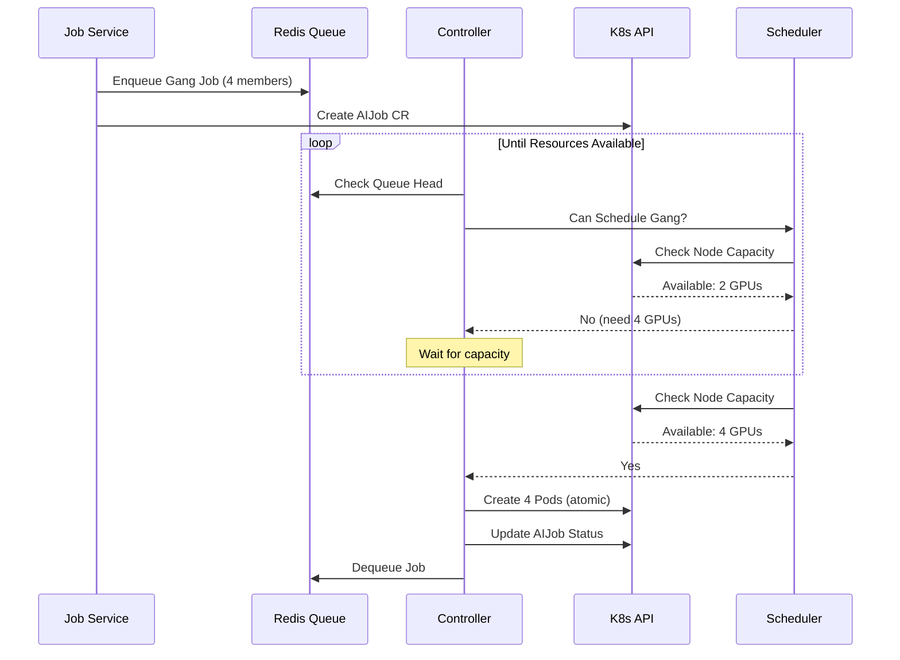

# System Architecture

## Overview

The K8s AI Job Orchestrator is a Kubernetes-native distributed job scheduling platform designed for high-throughput AI/ML workloads. It leverages Custom Resource Definitions (CRDs) to extend the Kubernetes API with domain-specific types for AI job orchestration.

## Design Principles

1. **Kubernetes-Native**: Leverage K8s primitives (CRDs, Controllers, Informers) for declarative state management
2. **High Throughput**: Decouple job ingestion from K8s API server using Redis as a fast queue
3. **Fault Tolerant**: Automatic retries, dead letter queues, and self-healing reconciliation loops
4. **Observable**: First-class metrics, tracing, and logging integration

## System Components

### 1. Control Plane (Go)

The control plane runs as a Kubernetes controller and manages the lifecycle of AI jobs.

| Component | Responsibility |
|-----------|----------------|
| **Controller Manager** | Runs reconciliation loops for all CRD types |
| **AIJob Reconciler** | Manages job lifecycle (Pending → Running → Completed) |
| **Queue Controller** | Manages AIJobQueue resources and concurrency limits |
| **Scheduler** | Implements Gang Scheduling and Priority Preemption |
| **Agent Registry** | Manages AI Agents for workflow automation |

**Key Implementation Details:**
- Uses `controller-runtime` for reconciliation
- Leader election ensures single active controller for consistency
- Informers provide efficient watch-based updates from K8s API

### 2. Data Plane (Python + Redis)

The data plane handles job submission, queueing, and persistence.

| Component | Responsibility |
|-----------|----------------|
| **Job Service (FastAPI)** | REST API for job submission, status queries |
| **Redis** | High-throughput priority queue, distributed locks |
| **PostgreSQL** | Persistent job history, metadata, audit logs |

**Key Implementation Details:**
- Stateless API servers scale horizontally
- Redis ZSET provides O(log N) priority queue operations
- Lua scripts ensure atomic dequeue operations

### 3. Compute Plane (Python Workers)

Workers execute the actual AI/ML workloads.

| Worker Type | Use Case |
|-------------|----------|
| **Inference Worker** | Model serving, batch inference |
| **Simulation Worker** | Synthetic data generation, sensor simulation |
| **Training Worker** | Distributed training with PyTorch DDP/FSDP |

## Custom Resource Definitions

### AIJob

Represents a single AI workload unit.

```yaml
apiVersion: aiplatform.example.com/v1alpha1
kind: AIJob
metadata:
  name: inference-job-001
spec:
  jobType: inference
  priority: 80
  image: pytorch-inference:v1.0
  resources:
    requests:
      cpu: "2"
      memory: "8Gi"
      nvidia.com/gpu: "1"
  gang:
    enabled: false
  retryPolicy:
    maxRetries: 3
    backoffMultiplier: 2
status:
  phase: Running
  startTime: "2024-01-15T10:00:00Z"
  conditions:
    - type: Scheduled
      status: "True"
```

### AIJobQueue

Manages job scheduling constraints for a namespace or workload type.

```yaml
apiVersion: aiplatform.example.com/v1alpha1
kind: AIJobQueue
metadata:
  name: high-priority-queue
spec:
  maxConcurrency: 100
  priorityClass: high
  preemptionPolicy: PreemptLowerPriority
```

### ComputeCluster

Defines a logical compute cluster for resource allocation.

```yaml
apiVersion: aiplatform.example.com/v1alpha1
kind: ComputeCluster
metadata:
  name: gpu-cluster
spec:
  nodeSelector:
    accelerator: nvidia-a100
  capacity:
    maxJobs: 500
    maxGPUs: 64
```

## Architecture Diagrams

### High-Level System Architecture



### Job Lifecycle State Machine



### Gang Scheduling Flow



## Data Flow

### Job Submission Flow

1. **Client Request**: User submits job via REST API
2. **Validation**: API validates request schema and authorization
3. **Persistence**: Job metadata written to PostgreSQL
4. **Queueing**: Job ID pushed to Redis priority queue (ZSET)
5. **CRD Creation**: AIJob Custom Resource created in Kubernetes
6. **Response**: Job ID returned to client

### Job Execution Flow

1. **Queue Processing**: Controller polls Redis for pending jobs
2. **Scheduling Decision**: Scheduler checks resource availability
3. **Gang Check**: For gang jobs, verify all members can be scheduled
4. **Pod Creation**: Controller creates worker pods
5. **Task Execution**: Worker pulls task details, executes workload
6. **Status Update**: Worker reports completion, Controller updates CRD
7. **Cleanup**: Completed pods cleaned up based on retention policy

## Scalability Considerations

| Component | Scaling Strategy |
|-----------|------------------|
| **Job Service** | Horizontal pod autoscaling based on request rate |
| **Redis** | Redis Cluster or Sentinel for HA; sharding by job type |
| **Controller** | Single leader with fast failover; shard by namespace if needed |
| **Workers** | Horizontal scaling; node autoscaling for GPU nodes |
| **PostgreSQL** | Read replicas; time-based partitioning for job history |

## Failure Handling

| Failure Mode | Recovery Strategy |
|--------------|-------------------|
| **API Server Down** | Load balancer routes to healthy replicas |
| **Redis Down** | Sentinel promotes replica; jobs recoverable from PostgreSQL |
| **Controller Crash** | Leader election promotes standby; reconciliation self-heals |
| **Worker Pod Crash** | K8s restarts pod; job retried based on retry policy |
| **Network Partition** | Distributed locks prevent duplicate execution |

## Security Model

- **Authentication**: JWT tokens for API access
- **Authorization**: Kubernetes RBAC for CRD operations
- **Network Policies**: Restrict pod-to-pod communication
- **Secrets Management**: K8s Secrets for credentials
- **Audit Logging**: All job operations logged to PostgreSQL
